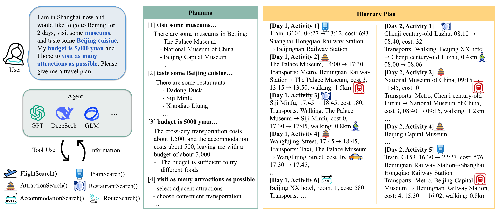

<center>
  <h1> [ICLR'26] ChinaTravel: A Real-World Benchmark for Language Agents in Chinese Travel Planning 
</h1>
</center>

Official codebase for the paper "ChinaTravel: A Real-World Benchmark for Language Agents in Chinese Travel Planning".

<!-- | [Webpage](https://www.lamda.nju.edu.cn/shaojj/chinatravel/) | [Paper](https://arxiv.org/abs/2412.13682) | [Dataset(Huggingface)](https://huggingface.co/datasets/LAMDA-NeSy/ChinaTravel)| -->

[](https://www.lamda.nju.edu.cn/shaojj/chinatravel/)
[](https://arxiv.org/abs/2412.13682)
[](https://huggingface.co/datasets/LAMDA-NeSy/ChinaTravel)
[](https://chinatravel-competition.github.io/IJCAI2025/)
[](TPC@AIC2025/readme.md)
[](https://chinatravel-competition.github.io/IJCAI2026/)


<!-- 
 -->

## 🏆 IJCAI 2026 Travel Planning Challenge (TPC@IJCAI)

We are proud to announce that ChinaTravel has been selected as the official benchmark for the **Travel Planning Challenge (TPC) @ IJCAI 2026**!

**Official Competition Website**:
[https://chinatravel-competition.github.io/IJCAI2026/](https://chinatravel-competition.github.io/IJCAI2026/)

Participants are invited to develop novel agentic system that can tackle real-world travel planning scenarios under practical requirements. This competition will showcase state-of-the-art approaches in agentic AI research.


## 🏆 IJCAI 2025 Travel Planning Challenge (TPC@IJCAI)

We are proud to announce that ChinaTravel has been selected as the official benchmark for the **Travel Planning Challenge (TPC) @ IJCAI 2025**!

**Official Competition Website**:
[https://chinatravel-competition.github.io/IJCAI2025/](https://chinatravel-competition.github.io/IJCAI2025/)

Participants are invited to develop novel agents that can tackle real-world travel planning scenarios under complex constraints. This competition will showcase state-of-the-art approaches in language agent research.

## 📝 ChangeLog

### 2025.09
1. Upload the champion solution of TPC@IJCAI2025 DSL track. Thanks the [@evergreenee](https://github.com/evergreenee) for their contributions.  


### 2025.06

1. Fix error collection in the evaluation code of commonsense. 
2. Fix pure-neuro agent's pipeline
3. Fix load_datasets from huggingface
4. Update exception handling in syntax verification


### 2025.05

1. Update logs for the latest version.
2. Provide the evaluation code for the TPC.

### 2025.04

1. Added local data loader. Users can now load custom queries locally. When specifying non-default splits_name values (e.g., "abc") for "run_exp.py", the system will automatically load corresponding files from evaluation/default_splits/abc.txt, where the TXT file contains the target query filenames.
2. Detailed constraints classification. See detailed docs at [Evaluation README](chinatravel/symbol_verification/readme.md)
3. Introduced LLM-modulo baseline
   Implement the LLM-modulo pipeline with a ground-truth symbolic verifier.
   Based on methodology from:
   Paper: Robust Planning with Compound LLM Architectures: An LLM-Modulo Approach
   Codebase: https://github.com/Atharva-Gundawar/LLM-Modulo-prompts
4. Support configurable LLM inference.

## 🚀 Quick Start

### ⚙️ Setup

1. Create a conda environment and install dependencies:

```bash
conda create -n chinatravel python=3.12
conda activate chinatravel  
pip install -r requirements.txt  
```

2. Download the database and unzip it to the "chinatravel/environment/" directory

Download Links: [Google Drive](https://drive.google.com/drive/folders/1bJ7jA5cfExO_NKxKfi9qgcxEbkYeSdAU), [NJU Drive](https://box.nju.edu.cn/d/dd83e5a4a9e242ed8eb4/)

3. Configure an OpenAI-compatible model endpoint.

ChinaTravel no longer requires local model weights or tokenizer downloads. Set
the API key and optional base URL for the endpoint you want to use:

```bash
export OPENAI_API_KEY=""
# Optional for OpenAI-compatible providers:
export OPENAI_BASE_URL="https://your-provider.example/v1"
# Optional: chat for OpenAI-compatible Chat Completions endpoints,
# or responses for the OpenAI Responses API.
export CHINATRAVEL_OPENAI_WIRE_API="chat"
# Optional when a provider uses a different token limit field:
export CHINATRAVEL_OPENAI_TOKEN_LIMIT_ARG="max_tokens"
# Optional while debugging provider integration:
export CHINATRAVEL_OPENAI_RAISE_ERRORS=1
# Optional when exporting strict OpenAI tool schemas from agent_env:
export CHINATRAVEL_OPENAI_STRICT_TOOLS=1
```

### ▶️ Running

The `--llm` value can be a built-in alias (`deepseek`, `gpt-4o`, `glm4-plus`) or
any model name served by an OpenAI-compatible endpoint. Alias and
provider-prefix matching is case-insensitive; the actual model id is preserved.

```bash
export OPENAI_API_KEY=""

python run_exp.py --splits easy --agent LLMNeSy --llm provider/model-name --oracle_translation
python run_exp.py --splits medium --agent LLMNeSy --llm provider/model-name --oracle_translation
python run_exp.py --splits human --agent LLMNeSy --llm provider/model-name --oracle_translation

python run_exp.py --splits human --agent LLMNeSy --llm provider/model-name

python run_exp.py --splits human --agent LLM-modulo --llm provider/model-name --refine_steps 10 --oracle_translation
```

**Note**:

- Query records are expected to use the fixed data format. In particular,
  `hard_logic_py` must already be a list when present; the loader validates the
  shape and does not patch older string-encoded annotations.
- The `--oracle_translation` flag enables access to annotated ground truth including:

  - `hard_logic_py`: Executable verification DSL code
  - `hard_logic_nl`: The corresponding constraint descriptions
  - Example annotation structure:

  ```python
  {
    "hard_logic_py": [
      "
      total_cost=0 
      for activity in allactivities(plan):
          total_cost+=activity_cost(activity)
              total_cost += innercity_transport_cost(activity_transports(activity))
      result=(total_cost<=1000)
      ", 
      "
      innercity_transport_set=set()
      for activity in allactivities(plan):
          if activity_transports(activity)!=[]:              
              innercity_transport_set.add(innercity_transport_type(activity_transports(activity)))
      result=(innercity_transport_set<={'taxi'})
      "
    ], 
    "hard_logic_nl": ["总预算为1800元", "市内交通选择taxi"], 
  }
  ```
- LLM-modulo method **requires** oracle_translation mode for its symbolic refinement process

### 📊 Evaluation

```bash
python eval_exp.py --splits human --method all --llm provider/model-name
python eval_exp.py --splits human --method LLMNeSy_provider_model-name_oracletranslation
python eval_exp.py --splits human --method LLMNeSy_provider_model-name
python eval_exp.py --splits human --method LLM-modulo_provider_model-name_10steps_oracletranslation

```

In TPC@IJCAI2025, the evaluation code is provided in the `eval_tpc.py` file. You can run the evaluation code as follows:

```bash
python eval_tpc.py --splits tpc_phase1 --method YOUR_METHOD_NAME
```

## 📚 Docs

[Environment](chinatravel/environment/readme.md)
[Constraints](chinatravel/symbol_verification/readme.md)
[Agent Environment](agent_env/README.md)

## 🛠️ Advanced Development

### 1. Develop Your Own Agent Algorithm

To develop your own agent algorithm, inherit the `BaseAgent` class from
`chinatravel/agent/base.py` and register a lazy builder in
`chinatravel/agent/load_model.py`. We provide an empty agent example named
`TPCAgent`.

Steps:

- **Inherit the `BaseAgent` class**: Create a new Python file in the `chinatravel/agent` directory and define your own agent class, inheriting from `BaseAgent`.

```python:chinatravel/agent/your_agent.py
from .base import BaseAgent

class YourAgent(BaseAgent):
    def __init__(self, **kwargs):
        super().__init__(**kwargs)
        # Initialization logic

    def act(self, observation):
        # Implement the decision - making logic of the agent
        pass
```

- **Register an agent builder**: Open `chinatravel/agent/load_model.py`, add a
  small builder function, and register it in `AGENT_BUILDERS`.

```python:
def _build_your_agent(kwargs):
    from .your_agent import YourAgent

    return YourAgent(**kwargs)


AGENT_BUILDERS = {
    # ... existing builders ...
    "YourMethodName": _build_your_agent,
}
```

### 2. Use Your Own Model

To use your own model, expose it through an OpenAI-compatible Chat Completions
endpoint or the OpenAI Responses API. You do not need to add a new Python class
or edit `init_llm`.

```bash
export OPENAI_API_KEY=""
export OPENAI_BASE_URL="https://your-provider.example/v1"
export CHINATRAVEL_OPENAI_WIRE_API="chat"
export CHINATRAVEL_OPENAI_TOKEN_LIMIT_ARG="max_tokens"
export CHINATRAVEL_OPENAI_RAISE_ERRORS=1
python run_exp.py --splits easy --agent LLMNeSy --llm your-model-name
```

For the OpenAI Responses API, set `CHINATRAVEL_OPENAI_WIRE_API=responses`.
The default token limit argument then becomes `max_output_tokens`; override
`CHINATRAVEL_OPENAI_TOKEN_LIMIT_ARG` only if your provider expects another field.
Responses mode requires `openai>=1.66.0`; Chat Completions mode remains the
default for broad OpenAI-compatible provider support.

Provider/model prefixes are also accepted when the provider alias is known, for
example `deepseek/deepseek-chat`. Built-in aliases are defined in
`chinatravel/agent/llms.py`.

### 3. Run Your Code Using Experiment Scripts

After completing the above development, you can use the experiment scripts to run your code.

Example of running:

```bash
python run_tpc.py --splits easy --agent TPCAgent --llm rule
python run_exp.py --splits easy --agent YourMethodName --llm your-model-name
```

The results will be saved in the `results/YourMethodName_YourLLMName_xxx` directory, e.g., `results/TPCAgent_rule`.

## ✉️ Contact

If you have any problems, please contact [Jie-Jing Shao](shaojj@lamda.nju.edu.cn), [Bo-Wen Zhang](221900200@smail.nju.edu.cn), [Xiao-Wen Yang](yangxw@lamda.nju.edu.cn).

## 📌 Citation

If our paper or related resources prove valuable to your research, we kindly ask for citation.

```
@inproceedings{
shao2026chinatravel,
title={ChinaTravel: An Open-Ended Travel Planning Benchmark with Compositional Constraint Validation for Language Agents},
author={Jie-Jing Shao and Bo-Wen Zhang and Xiao-Wen Yang and Baizhi Chen and Siyu Han and Pang Jinghao and Wen-Da Wei and Guohao Cai and Zhenhua Dong and Lan-Zhe Guo and Yu-Feng Li},
booktitle={The Fourteenth International Conference on Learning Representations},
year={2026},
url={https://openreview.net/forum?id=0YRVlxY9BH}
}
```
# travel
